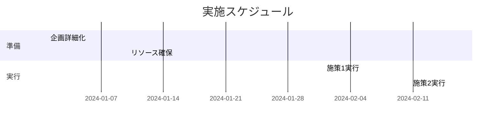

# Markdown活用基礎

**所要時間**: 45分  
**レベル**: 基礎  
**前提知識**: [AI基本操作](01-ai-basics.md)

## 学習目標

この講座を修了すると、以下ができるようになります：
- Markdownの基本記法を理解し、実践的に使える
- AIとの対話でMarkdownを効果的に活用できる
- 文書構造化とフォーマット指定を使い分けられる
- GitHub、Notion等でのMarkdown活用ができる

## 📋 目次

1. [Markdownとは](#markdownとは)
2. [基本記法マスター](#基本記法マスター)
3. [AIとの対話でのMarkdown活用](#aiとの対話でのmarkdown活用)
4. [実践的な活用パターン](#実践的な活用パターン)
5. [プラットフォーム別活用法](#プラットフォーム別活用法)

---

## Markdownとは

### 🤔 Markdownの特徴

**Markdown**は、軽量なマークアップ言語で、プレーンテキストで記述しながら構造化された文書を作成できます。

#### なぜMarkdownが重要か
```
従来の文書作成:
Word、PowerPoint → 重い、互換性問題

Markdownの利点:
- 軽量・高速
- プラットフォーム非依存
- バージョン管理可能
- AI対話に最適
```

#### AI時代におけるMarkdownの価値
- **構造化された指示**: AIに明確な指示を出せる
- **フォーマット指定**: 出力形式を正確に伝えられる
- **再利用性**: 一度作成したテンプレートを何度も使える
- **可読性**: 人間とAIの両方にとって読みやすい

---

## 基本記法マスター

### 📝 見出し（Headers）

```markdown
# 見出し1（最大）
## 見出し2
### 見出し3
#### 見出し4
##### 見出し5
###### 見出し6（最小）
```

#### AIでの活用例
```markdown
# プロジェクト企画書

## 概要
[プロジェクトの概要を記述]

## 目標
### 短期目標
### 長期目標

## 実施計画
### フェーズ1
### フェーズ2
```

### 🎯 強調表現

```markdown
**太字（Bold）**
*斜体（Italic）*
***太字＋斜体***
~~取り消し線~~
`インラインコード`
```

#### 使い分けのコツ
- **太字**: 重要なポイント、キーワード
- *斜体*: 補足説明、外国語
- `インラインコード`: コマンド、ファイル名、変数名

### 📋 リスト

#### 箇条書きリスト
```markdown
- アイテム1
- アイテム2
  - サブアイテム2.1
  - サブアイテム2.2
- アイテム3

または

* アイテム1
* アイテム2
+ アイテム3
```

#### 番号付きリスト
```markdown
1. 第一ステップ
2. 第二ステップ
   1. サブステップ2.1
   2. サブステップ2.2
3. 第三ステップ
```

#### チェックリスト
```markdown
- [x] 完了したタスク
- [ ] 未完了のタスク
- [x] 完了したタスク2
- [ ] 未完了のタスク2
```

### 🔗 リンクと画像

#### リンク
```markdown
[リンクテキスト](URL)
[Google](https://www.google.com)

[参照リンク][1]
[1]: https://www.example.com "説明文"
```

#### 画像
```markdown


![画像][image1]
[image1]: https://example.com/image.png "画像の説明"
```

### 📊 表（Table）

```markdown
| 項目1 | 項目2 | 項目3 |
|-------|-------|-------|
| データ1 | データ2 | データ3 |
| データ4 | データ5 | データ6 |

# 列の整列指定
| 左寄せ | 中央寄せ | 右寄せ |
|:-------|:-------:|-------:|
| Left   | Center  | Right  |
```

### 💻 コードブロック

#### インラインコード
```markdown
`code`や`変数名`をテキスト内で表現
```

#### コードブロック
````markdown
```
基本的なコードブロック
```

```javascript
// 言語指定付きコードブロック
function hello() {
    console.log("Hello, World!");
}
```

```python
# Pythonの例
def greet(name):
    return f"Hello, {name}!"
```
````

### 📑 引用

```markdown
> これは引用文です。
> 複数行の引用も可能です。

> ## 引用内での見出し
> 引用内でも**強調**や*斜体*が使えます。

>> ネストした引用
```

### ✅ その他の記法

#### 水平線
```markdown
---
または
***
または
___
```

#### エスケープ
```markdown
\*この星印は強調にならない\*
\# この井戸はヘッダーにならない
```

---

## AIとの対話でのMarkdown活用

### 🎯 構造化された指示の出し方

#### ❌ 悪い例
```
レポートを作成してください。内容は売上分析で、グラフも含めて、結論も書いて。
```

#### ✅ 良い例
```markdown
# 売上分析レポート作成依頼

## 要件
- **対象期間**: 2024年1-3月
- **分析対象**: 商品別売上データ
- **出力形式**: Markdown形式

## 必要な内容
1. **エグゼクティブサマリー**
2. **データ分析**
   - 売上トレンドグラフ
   - 商品別比較表
3. **結論と提言**

## 出力形式
以下の構造で出力してください：
```
# 売上分析レポート（2024年Q1）

## エグゼクティブサマリー
[要約を記述]

## データ分析
### 売上トレンド
[グラフの説明]

### 商品別売上
| 商品名 | 売上額 | 前年比 |
|--------|--------|--------|

## 結論と提言
[結論を記述]
```
```

### 📋 テンプレート指定の活用

#### 議事録テンプレート指定
```markdown
以下の議事録テンプレートに従って、会議内容を整理してください：

# 議事録テンプレート
**日時**: YYYY-MM-DD HH:MM-HH:MM  
**場所**: [場所]  
**参加者**: [参加者リスト]  
**司会**: [司会者]  
**記録**: [記録者]  

## アジェンダ
1. [議題1]
2. [議題2]
3. [議題3]

## 議論内容
### [議題1]
- **概要**: [議論の概要]
- **主な意見**: 
  - [意見1]
  - [意見2]
- **決定事項**: [決定内容]

## アクションアイテム
- [ ] [タスク1] - 担当: [担当者] - 期限: [期限]
- [ ] [タスク2] - 担当: [担当者] - 期限: [期限]

## 次回予定
**日時**: [次回日時]  
**場所**: [次回場所]  
**議題**: [次回議題]
```

### 🔧 フォーマット制御のプロンプト

#### 表形式での出力指定
```markdown
以下の情報を表形式で整理してください：

| 項目 | 詳細 | 備考 |
|------|------|------|
| [項目1] | [詳細1] | [備考1] |
| [項目2] | [詳細2] | [備考2] |

追加で以下の条件に従ってください：
- 各項目は**太字**で強調
- 重要度の高い項目には⭐をマーク
- 緊急度の高い項目には🚨をマーク
```

#### 段階的な説明指定
```markdown
以下の構造で段階的に説明してください：

## 概要（1分で理解）
[概要を3行で説明]

## 詳細説明（5分で理解）
### ポイント1
[詳細説明1]

### ポイント2
[詳細説明2]

## 実践編（実際にやってみる）
1. **ステップ1**: [具体的な手順1]
2. **ステップ2**: [具体的な手順2]
3. **ステップ3**: [具体的な手順3]

## よくある質問
**Q**: [よくある質問1]  
**A**: [回答1]

**Q**: [よくある質問2]  
**A**: [回答2]
```

---

## 実践的な活用パターン

### 📝 文書作成での活用

#### 企画書テンプレート
```markdown
# [企画名] 企画書

**提案者**: [名前]  
**提案日**: [日付]  
**実施予定**: [期間]  
**予算**: [予算]  

## 📋 企画概要
[企画の概要を3-5行で記述]

## 🎯 目的・目標
### 目的
[なぜこの企画を行うのか]

### 目標
- **定量目標**: [数値目標]
- **定性目標**: [質的目標]

## 📊 現状分析
### 課題
1. [課題1]
2. [課題2]
3. [課題3]

### 機会
1. [機会1]
2. [機会2]

## 💡 解決策・提案内容
### アプローチ
[どのように解決するか]

### 具体的な施策
| 施策 | 内容 | 期待効果 | 担当 | 期限 |
|------|------|----------|------|------|
| [施策1] | [内容1] | [効果1] | [担当1] | [期限1] |
| [施策2] | [内容2] | [効果2] | [担当2] | [期限2] |

## 📅 実施スケジュール


## 💰 予算・リソース
### 予算内訳
| 項目 | 金額 | 備考 |
|------|------|------|
| [項目1] | [金額1] | [備考1] |
| [項目2] | [金額2] | [備考2] |
| **合計** | **[合計]** | |

### 必要リソース
- **人的リソース**: [人数・スキル]
- **物的リソース**: [必要な物品・設備]
- **外部リソース**: [外注・パートナー]

## 📈 効果測定・KPI
| KPI | 現状値 | 目標値 | 測定方法 | 測定頻度 |
|-----|--------|--------|----------|----------|
| [KPI1] | [現状1] | [目標1] | [方法1] | [頻度1] |
| [KPI2] | [現状2] | [目標2] | [方法2] | [頻度2] |

## ⚠️ リスクと対策
| リスク | 影響度 | 発生確率 | 対策 |
|--------|--------|----------|------|
| [リスク1] | [高/中/低] | [高/中/低] | [対策1] |
| [リスク2] | [高/中/低] | [高/中/低] | [対策2] |

## ✅ 承認・決裁
- [ ] 部門長承認
- [ ] 予算承認
- [ ] 実行承認

## 📞 問い合わせ先
**担当者**: [名前]  
**連絡先**: [メール・電話]  
**部署**: [部署名]
```

### 📚 学習ノート作成

#### 学習内容整理テンプレート
```markdown
# [学習テーマ] 学習ノート

**学習日**: [日付]  
**学習時間**: [時間]  
**情報源**: [書籍・動画・記事など]  

## 🎯 学習目標
- [目標1]
- [目標2]
- [目標3]

## 📚 重要ポイント

### 概念・理論
#### [概念1]
**定義**: [定義]  
**重要性**: [なぜ重要か]  
**具体例**: [例]  

#### [概念2]
**定義**: [定義]  
**重要性**: [なぜ重要か]  
**具体例**: [例]  

### 実践的スキル
1. **[スキル1]**
   - 手順: [手順]
   - コツ: [コツ]
   - 注意点: [注意点]

2. **[スキル2]**
   - 手順: [手順]
   - コツ: [コツ]
   - 注意点: [注意点]

## 💡 気づき・発見
- [気づき1]
- [気づき2]
- [気づき3]

## ❓ 疑問・要調査項目
- [ ] [疑問1]
- [ ] [疑問2]
- [ ] [疑問3]

## 🚀 次のアクション
- [ ] [アクション1] - 期限: [期限]
- [ ] [アクション2] - 期限: [期限]
- [ ] [アクション3] - 期限: [期限]

## 🔗 関連リンク・参考資料
- [リンク1](URL1) - [説明1]
- [リンク2](URL2) - [説明2]

## 📝 復習用サマリー
[重要ポイントを3-5行でまとめ]
```

---

## プラットフォーム別活用法

### 💻 GitHub・GitLab

#### README.md作成
```markdown
# プロジェクト名

[](https://travis-ci.org/user/repo)
[](https://opensource.org/licenses/MIT)

## 概要
[プロジェクトの概要を1-2行で説明]

## 特徴
- ✨ [特徴1]
- 🚀 [特徴2]
- 🔧 [特徴3]

## インストール
```bash
npm install project-name
```

## 使い方
```javascript
const project = require('project-name');

// 基本的な使用例
project.doSomething();
```

## API リファレンス

### `functionName(param1, param2)`
[関数の説明]

**パラメータ**:
- `param1` (string): [パラメータ1の説明]
- `param2` (number): [パラメータ2の説明]

**戻り値**: [戻り値の説明]

**例**:
```javascript
const result = functionName('example', 42);
```

## 貢献
1. このリポジトリをフォーク
2. フィーチャーブランチを作成 (`git checkout -b feature/AmazingFeature`)
3. 変更をコミット (`git commit -m 'Add some AmazingFeature'`)
4. ブランチをプッシュ (`git push origin feature/AmazingFeature`)
5. プルリクエストを作成

## ライセンス
このプロジェクトは [MIT License](LICENSE) の下で公開されています。

## 作者
[名前] - [@twitter](https://twitter.com/username) - email@example.com

## 謝辞
- [謝辞対象1]
- [謝辞対象2]
```

### 📓 Notion

#### データベースとの連携
```markdown
# Notion用フォーマット

## プロパティ指定
**タイトル**: [タイトル]
**ステータス**: 進行中
**優先度**: 高
**担当者**: @[担当者名]
**期限**: 2024-12-31
**タグ**: #プロジェクト #重要

## 内容
[Markdownで記述した内容がNotionで適切にフォーマットされる]

### サブページへのリンク
[[サブページ名]] で内部リンクを作成

### データベースの埋め込み
[Notionデータベースの埋め込みコード]
```

### 📱 Discord・Slack

#### メッセージフォーマット
```markdown
# Discord/Slack用フォーマット

## コードブロック
```python
# Pythonコードの共有
def hello_world():
    print("Hello, World!")
```

## インラインコード
`コマンド`や`ファイル名`の記述

## リスト（一部プラットフォームで制限あり）
• アイテム1
• アイテム2
• アイテム3

## 強調（プラットフォーム依存）
**太字** または *斜体*
```

### 📊 Obsidian・Zettlr

#### 学術的文書作成
```markdown
# 学術文書用Markdown

## 引用
> 重要な引用文 [@author2024]

## 脚注
これは本文です[^1]。

[^1]: これは脚注の内容です。

## 数式（LaTeX）
インライン数式: $E = mc^2$

ブロック数式:
$$
\frac{d}{dx}\left( \int_{0}^{x} f(u) \, du\right) = f(x)
$$

## 相互リンク
[[関連ノート]]への内部リンク
[[関連ノート#セクション]]への特定セクションリンク

## タグ
#研究 #重要 #レビュー必要
```

---

## 💡 実践演習

### 演習1: 基本記法の習得

以下の内容をMarkdown形式で作成してください：

```
タスク: 自己紹介ページの作成

含める要素:
- 見出し（名前、経歴、スキル、趣味）
- 太字・斜体の使い分け
- 箇条書きリスト
- 表（スキル一覧）
- リンク（SNSやポートフォリオ）
- 引用（好きな言葉）
```

### 演習2: AIとの対話実践

以下のシナリオでAIに指示を出してください：

```
シナリオ: 会社の新製品発表プレゼンテーション資料の作成依頼

条件:
- Markdown形式での構造化指示
- テンプレート指定を含む
- 出力形式の詳細指定
- 表やリストの活用
```

### 演習3: プラットフォーム対応

同じ内容を以下の形式で作成し、違いを確認してください：

```
内容: プロジェクト進捗報告

対象プラットフォーム:
1. GitHub README形式
2. Notion ページ形式
3. Slack メッセージ形式
4. 一般的なMarkdown形式
```

---

## 📚 参考資料

### Markdown記法リファレンス
- [CommonMark Spec](https://commonmark.org/)
- [GitHub Flavored Markdown](https://github.github.com/gfm/)
- [Markdown Guide](https://www.markdownguide.org/)

### プラットフォーム別ドキュメント
- [GitHub Markdown](https://docs.github.com/en/get-started/writing-on-github)
- [Notion Markdown Support](https://www.notion.so/help/writing-and-editing-basics)
- [Discord Markdown](https://support.discord.com/hc/en-us/articles/210298617)

### エディタ・ツール
- [Typora](https://typora.io/) - リアルタイムプレビュー
- [Mark Text](https://marktext.app/) - オープンソース
- [Obsidian](https://obsidian.md/) - ナレッジマネジメント
- [Zettlr](https://www.zettlr.com/) - 学術文書向け

---

## ✅ 理解度確認

この講座の内容を理解できたか、以下で確認してください：

1. Markdown基本記法を実践的に使えますか？
2. AIとの対話でMarkdownを効果的に活用できますか？
3. 構造化された指示を出せますか？
4. プラットフォーム別の違いを理解していますか？
5. 実際の業務でMarkdownを活用できますか？

すべて「はい」なら次の講座に進めます。

---

**次の講座**: [XML基礎](06-xml-basics.md)